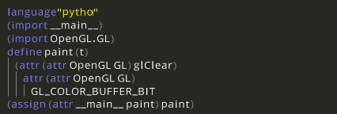

# Structure Editor, for .t+ -files.

I've stopped working on this project for now. The problem I found hard to solve is parsing the user input into structures without ending up with limitations of just parsing it all in the first place.

If you decide to try it, make sure you've got pysdl2, pysdl2 image, pyopengl and textended. I've tried it with python 2.7

On ubuntu the dependencies can be satisfied with:

    sudo apt-get install python-opengl libsdl2-2.0-0 libsdl2-image-2.0-0
    sudo pip install pysdl2

You can obtain textended by:

    git clone https://github.com/cheery/textended/

It's just a module in a different repository so it's enough if you place the cloned directory inside the editor's repository.

On Windows platform you might not find SDL2_image. It is available in: https://www.libsdl.org/projects/SDL_image/ Place it into the PYSDL2_DLL_PATH.

The editor is implemented as a python script `edit.py`. It doesn't run without an argument. You can pass it any file ending with `.t+`. Many files are in outdated format, but all of them should open. Here's an example command that should run:

    python edit.py samples/distracted_99_bottles.t+

Specification:

 * [Draft of the specification](https://docs.google.com/document/d/11IUQ77CNGlKYNRPlC2a9ZDM6PqHlUvd4R5-ugqcIbnM/edit?usp=sharing)

Related blog posts: 

 * http://boxbase.org/entries/2014/dec/29/first-editor-release/
 * http://boxbase.org/entries/2015/jan/19/textended-layout-engine/
 * http://boxbase.org/entries/2015/feb/2/bottom-up-down-dissonance/
 * http://boxbase.org/entries/2015/feb/9/textended-schema/
 * http://boxbase.org/entries/2015/feb/16/projectional-repl/
 * http://boxbase.org/entries/2015/feb/23/why-cfg-as-schema/

There's an IRC channel #essence in irc.freenode.net, for those who like to discuss about visual programming/structured editing.

## Screenshots

The screenshots are old, but current version has similar functionality.

Here's a screenshot from `samples/clearscreen.t+`, first with default layouting...

Next with python layouting...

Compiler and layouter are using similar matching rules. The rules in `extensions/python/__init__.py` were initially copied from `treepython.py`.
